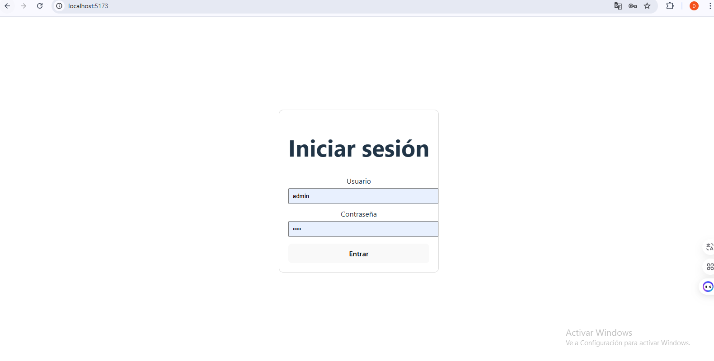
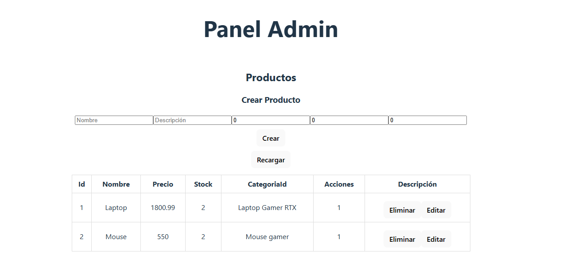
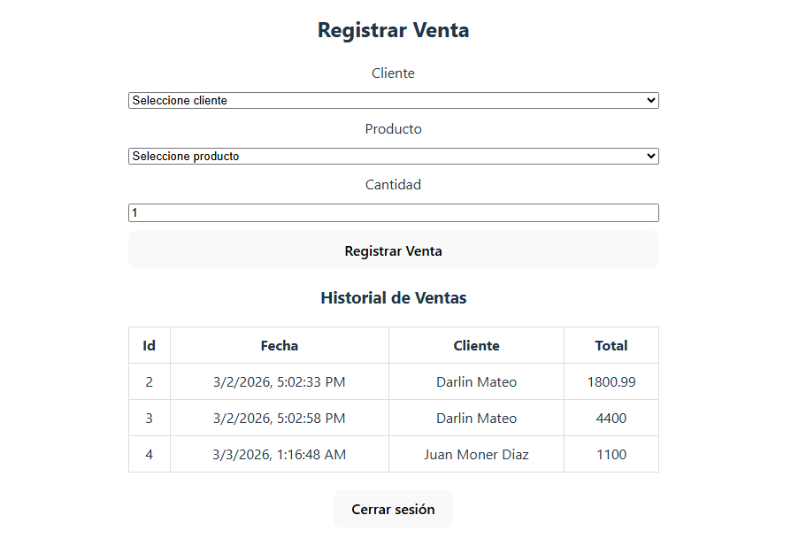

# 🛒 Full Stack Sales System


Full Stack Sales Management System built with **.NET 9**, **SQL Server**, **Vue 3** and **JWT Authentication**.

This project demonstrates layered architecture, SOLID principles, authentication, RESTful API development, and frontend-backend integration.

---

## 🚀 Technologies Used

### Backend
- .NET 9
- ASP.NET Core Web API
- Entity Framework Core
- SQL Server
- JWT Authentication
- xUnit (Unit Testing)
- Repository & Service Pattern
- Swagger

### Frontend
- Vue 3 (Composition API)
- Axios
- Vite
- JWT Token Handling
- Responsive Layout

---

## 🏗 Architecture

The backend follows a layered architecture:

```
Controllers
   ↓
Services
   ↓
Repositories
   ↓
Database (SQL Server)
```

- Separation of concerns
- Dependency Injection
- SOLID principles
- Clean Code practices

---

## 🔐 Authentication

- JWT-based authentication
- Protected endpoints using `[Authorize]`
- Axios interceptor for automatic token injection

---

## 📦 Features

### ✅ Products
- Create
- Update
- Delete
- List

### ✅ Clients
- Create
- Update
- Delete
- List

### ✅ Sales
- Register sale
- Automatic stock reduction
- Sale history
- Sale details

---

## 🧪 Unit Testing

Includes unit tests for business logic using:

- xUnit
- EF Core InMemory
- Service Layer Testing

---

## ⚙️ How to Run the Project

### 🔹 Backend

1. Open `tienda-backend` in Visual Studio 2022
2. Run migrations:

```
Update-Database
```

3. Run the project

---

### 🔹 Frontend

```
cd tienda-frontend
npm install
npm run dev
```

---

## 📌 Future Improvements

- Role-based authorization (Admin/User)
- Better UI/UX styling
- Docker support
- Deployment to cloud (Azure / AWS)
- Logging system
- Global error handling middleware

---

## 👨‍💻 Author

Darlin Mateo 
Full Stack Developer in Progress 🚀

## 📸 Screenshots

### 🔐 Login


### 📦 Products


### 🧾 Sales

